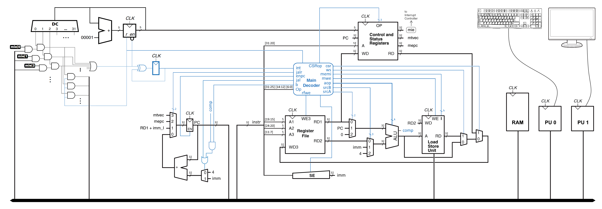

# RISC-V | PROCESSOR 

## Overview

- [Description](#description)
    - [Scheme](#scheme)
- [Progress](#progress)
  - [What I learned](#what-i-learned)
  - [Useful resources](#useful-resources)
  - [Software](#software)
  - [Author](#author)

## Description

The centric point of this project is the development of the main components of the CPU with RISC-V architecture, memory, and controlling peripheral devices. The processor includes an instructions decoder, register memory, interrupt controller, arithmetic logic unit (ALU), and load-save unit (LSU). You can learn the main connection principles and components from the scheme below.

### Scheme

## Progress

### What I learned

First of all, I got a basic understanding of how CPU works and took part in it's development. The simulationg of machinary processes in real time while code was growing with feartures and turning more complicated was awesome. The whole work consists of SystemVerilog, and Verilog code, so I improved my skills in these languages. 

Learning was separeted on eight parts:
- ALU
- Register File & Memory
- Decoder
- Datapath
- Load/Store Unit
- Interrupt Subsystem
- Peripheral Units
- C Programming

### Useful resources

- [RISC-V instructions simulator](https://venus.kvakil.me/) - [Github](https://github.com/kvakil/venus)
- [RISC-V specification](https://riscv.org/technical/specifications/)

### Software

__List of used software:__
* Vivado 2020.1
* Visual Studio Code
* Git

### Author

- [Ilya Chichkov](https://github.com/IlyaChichkov)
